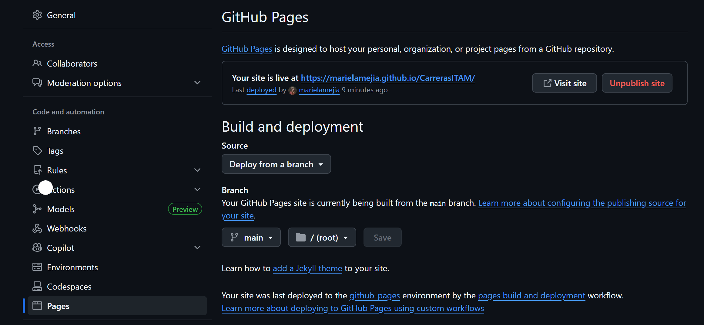

# CarrerasITAM
En este repositorio se encuentra una réplica del sitio web de carreras ITAM. Esta réplica se hizo como asignación del curso de desarrollo web y se utilizó bootstrap para su elaboración.
## Objetivo
El objetivo de esta réplica es refozar los temas vistos en clase de HTML y aprender a usar de manera profunda y autónoma bootstrap, el cual nos ayuda a construir un sitio web responsivo de manera más rápida. 
## Generalidades
### Imágenes utilizadas
Para esta página, se trabajó con las mismas imágenes que aparecen en la página oficial del ITAM. Esto con el objetivo de hacerla lo más parecida posible. 
A su vez, los links de la réplica funcionan de igual manera que la página de Carreras, es decir, nos llevan a otras ligas donde podemos ver los videos de YouTube y los planes de estudio de cada carrera que ofrece el ITAM. 
### Proceso que se siguió
Como primera instancia, creamos una carpeta en nuestro equipo, en ella guardaremos todo el proyecto. Después, utilizamos el comando 

git clone https://github.com/marielamejia/CarrerasITAM.git

para clonar el repositorio. 
Creamos las carpetas de imágenes "imagenesCarreras", "planes de estudio" e "imagenesPagina" donde guardamos las imágenes de las carreras que ofrece el ITAM y las imágenes del resto de la página, respectivamente. 
Posteriormente, creamos las diferentes branches a utilizar durante la elaboración de la página web, en este caso fueron:
- branchReadMe
- bannerITAM
- planesEstudioCards
- branchProgramasConjuntosITAM
- branchFooter
- navBar

Como observamos en la siguiente imagen, en la parte superior de nuestro editor de código Visual Studio Code, podemos agregar las branches necesarias. La división de estas se hizo considerando las diferentes secciones que se trabajan de la página web. 

Se cambió de branch cada vez que se trabajó en una sección diferente. Por ejemplo, primero se trabajo en la parte del banner ITAM por lo que usamos esa branch e hicimos todas las modificaciones necesarias. Dichas modificaciones incluyen el uso de texto e iconos sobre la imagen, para lo cual nos apoyamos de bootstrap (para los iconos) y nuestro archivo styles.css
Una vez terminando las ediciones necesarias, desde VSCode se hizo el commit hacia nuestro repositorio de Github (nótese que el archivo dice ReadMe pero esto varia pues en ese apartado nos aparecen los archivos editados).

Después, se da clic en el botón de commit y después en sync changes. Una vez dado clic en este, nos vamos a Github donde nos aparece un pull request, así como el siguiente:

Damos clic en el botón verde y checamos que no hayan conflictos para hacer nuestro merge con el main. Cabe destacar que este proceso se repite para cada branch que se utiliza y que se debe cambiar de branch al trabajar en una sección distinta. NOTA: Es importante hacer los commmits y pull request necesarios antes de cambiar de branch, con el fin de evitar conflictos en nuestro merge.  

## Descripción de cada sección
Antes de iniciar con las descripciones, cabe aclarar que todas se hicieron de manera responsive con el objetivo de que se adaptaran a la pantalla del dispositivo móvil en el cual se está visitando la página. Para ello, en cada sección me guie de la siguiente liga de Bootstrap para poder trabajar correctamente con los grids: https://getbootstrap.com/docs/5.3/layout/grid

### Nav Bar
Para la navBar, utilizamos el ejemplo visto en clase y construimos a partir de este. En primera instancia, se editó los contenidos de la navBar para que coincidiera con los apartados que maneja la página de carreras ITAM. A cada uno de ellos se le hizo la configuración correspondiente, es decir, se agregaron las DropDown lists o los link a otras páginas del ITAM para seguir navegando. Nótese que la navBar siempre queda estática aun al navegar a partes inferiores de la página. Para lograr esto, se usó el fixed-top, así como en la siguiente línea de nuestro código de html:

      <nav class="navbar navbar-expand-lg fixed-top navbar-itam">

Una vez teniendo eso, solo se agregó la imagen del logo ITAM con fondo transparente y se trabajó en el degradado. Para este último, se utilizó la herramienta de inspeccionar página y utilizamos los mismos colores y métodos que en la página oficial para lograr el mismo efecto. 

### Banner ITAM
Para esta primera sección, descargamos la imagen de la página de Carreras ITAM, la cual ya traía el filtro verde que se muestra en la página. Se generó una nueva section dentro de nuestro main en la cual agregamos la imagen del banner. Sobre esta, se agregó texto e iconos de las redes sociales del ITAM. Para ello, se utilizó bootstrap para obtener los iconos y los estilos necesarios se declararon en nuestra clase style.css. Algunos estilos que se tuvieron que crear fueron: el del banner para que la imagen abarcara la pantalla completa, que fuera responsivo y, que el texto añadido estuviera por encima de la imagen. 

El link utilizado para usar los iconos de bootstrap es: "https://cdn.jsdelivr.net/npm/bootstrap-icons@1.11.3/font/bootstrap-icons.min.css"

### Cards sobre planes de estudio
Para esta sección, utilizamos los cards vistos en clase durante nuestra introducción a Bootstrap. A partir de este diseño, se hizo una sección con 4 renglones (rows) diferentes, así se manejaron 4 cards por renglón. Esta sección se maneja de manera sencilla, se crea un row y dentro de ese agregamos 4 cards. Este proceso se repitió hasta obtener las 4 rows que queremos con sus respectivas imágenes de cada carrera que ofrece el ITAM. 
Las cards tienen 3 características principales
1. Al seleccionar el nombre de la carrera, este cambia de color a verde y si se da clic abre una pestaña nueva para explorar más de la carrera deseada
2. Al pasar sobre una card, esta hace un movimiento
3. Al pasar el mouse sobre la leyenda "Plan de estudios" esta se vuelve verde, así como con el nombre de la carrera y, al darle clic, nos abre el pdf.

Para lograr el movimiento de las cards se usaron los estilos de .margen-cards que podemos ver en el styles.css. Por otro lado, para trabajar con los PDF's se hizo una carpeta donde se guardaron todos los archivos y se usaron los modals de bootstrap para lograr el pop-up del PDF. Sin embargo, al usar el modal para pantallas pequeñas, el PDF no cargaba correctamente por lo que se optó hacer la configuración para que con dispositivos más pequeños el plan de estudios se abra en una pestaña nueva, facilitando la lectura del documento para nuestro usuario. 

Link usado de Bootstrap: https://getbootstrap.com/docs/5.3/components/modal/ 

### Programas conjuntos y dobles grados
En esta sección se trabajaron con dos textos divididos dos columnas en un mismo renglón. Este se tuvo que ajustar para que se viera bien en todos los dispositivos, para ello, se usó:

            

                <h3 class="display-6 fw-bold heading-green lh-1 mb-0">
                    Programas   conjuntos
                </h3>
            

.
.
.

Después de esto, se trabajó con los videos de YouTube. Personalmente, esta fue una de las parte que más me costó hacer. Para ello, se usó un container y dentro de el se definió la imagen que se quería usar como botón y al darle clic se le agrega la funcionalidad del iframe con el URL del video para que este se reproduzca. Para esta sección, se repitió este mismo proceso 2 veces pues tenemos dos apartados de texto y dos de video.

### Footer
Para el footer, se sigue un proceso similar al de la sección de cards. Sin embargo, en este caso dividimos la sección en 4 columnas diferentes. Una vez teniendo las columnas, solo se agrega la información que tiene la página:
- En la primera columna tenemos el logo ITAM y los iconos de sus redes sociales
- En la segunda tenemos el menú, donde cada texto nos lleva a la página del ITAM correspondiente, como inicio, intercambio, etc.
- En la tercera tenemos la dirección del ITAM
- En la cuarta la informaciónn de contacto para más información

Una vez teniendo dicha información, nos centramos en la parte responsiva pues al hacer la página más pequeña, las columnas aparecen de una en una. Para ello, se hizo de las propiedades de col. Por otro lado, observamos que el apartado de "Aviso de privacidad" aparece como pare de la primera columna en la pantalla completa (en la de la computadora). Sim embargo, al hacer la pantalla más pequeña como en los casos de los iPads o de los teléfonos, el "Aviso de privacidad" sale hasta abajo, después de todas las columnas. 
Para lograr esto, se hicieron dos &lt;p&gt;, el primero solo aparece visible en la página al ser pantalla completa y se oculta al hacerla más pequeña mientras que nuestro segundo &lt;p&gt; trabaja de manera inversa.

## Despliegue en Github pages
Para el despliegue en Github pages, se siguieron los siguientes pasos:
- Asegurarnos de que nuestros archivos se encuentren en la carpeta raíz del proyecto, esto incluye los documentos index.html, styles.css y nuestras 3 carpetas de imágenes.
- Para el correcto despliegue nos debemos asegurar que las rutas utilizadas en el código fueron rutas relativas, por ejemplo: ./imagenesPagina/banner.webp
- Como tercer punto, subimos nuestro proyecto a github, utilizando los comandos antes explicadoa, commits, pull y push, según sea el caso
- Una vez teniendo el código en nuestro repositorio de Github, entramos a "settings" --> "pages" 
- Damos clic en "build and deployment" y vemos lo siguiente --> Source: “Deploy from a branch", Branch: main, Folder: / (root), debe quedar como en la siguiente imagen:

A continuación, se presenta el link obtenido del despliegue de la página: 

https://marielamejia.github.io/CarrerasITAM

## Links de pull request
### Pull request de código 
https://github.com/marielamejia/CarrerasITAM/pull/7

https://github.com/marielamejia/CarrerasITAM/pull/6

https://github.com/marielamejia/CarrerasITAM/pull/4

### Pull request de evidencia
