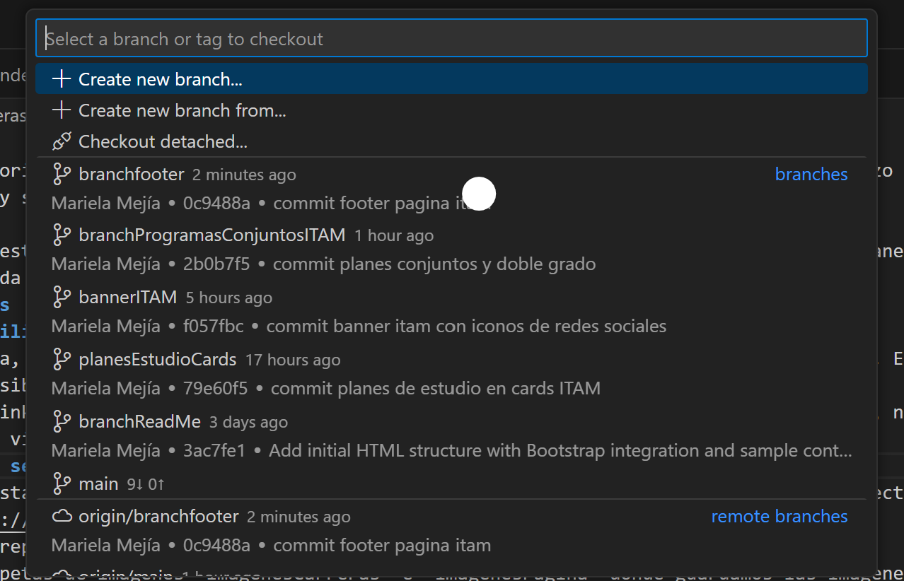
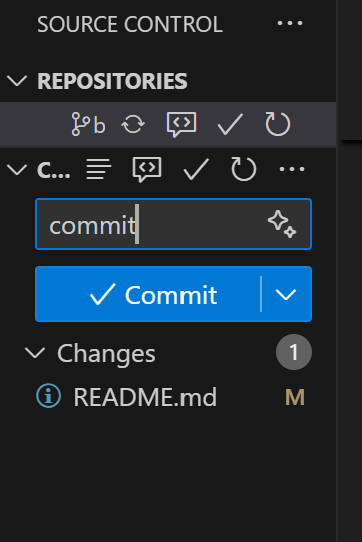
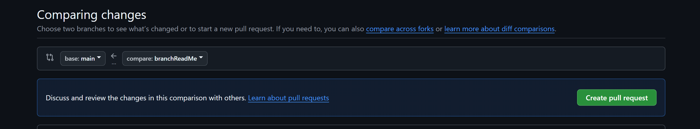
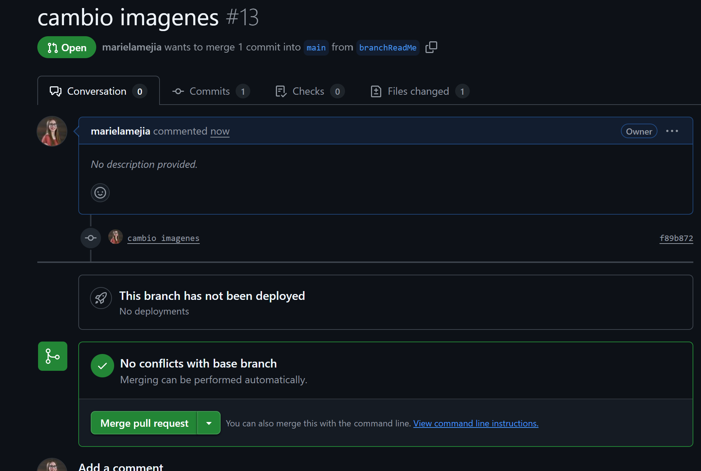

# CarrerasITAM
En este repositorio se encuentra una réplica del sitio web de carreras ITAM. Esta réplica se hizo como asignación del curso de desarrollo web y se utilizó bootstrap para su elaboración.
## Objetivo
El objetivo de esta réplica es refozar los temas vistos en clase de HTML y aprender a usar de manera profunda y autónoma bootstrap, el cual nos ayuda a construir un sitio web responsivo de manera más rápida. 
## Generalidades
### Imágenes utilizadas
Para esta página, se trabajó con las mismas imágenes que aparecen en la página oficial del ITAM. Esto con el objetivo de hacerla lo más parecida posible. 
A su vez, los links de la réplica funcionan de igual manera que la página de Carreras, es decir, nos llevan a otras ligas donde podemos ver los videos de YouTube y los planes de estudio de cada carrera que ofrece el ITAM. 
### Proceso que se siguió
Como primera instancia, creamos una carpeta en nuestro equipo, en ella guardaremos todo el proyecto. Después, utilizamos el comando 
git clone https://github.com/marielamejia/CarrerasITAM.git
para clonar el repositorio en nuestro equipo. 
Creamos las carpetas de imágenes "imagenesCarreras" e "imagenesPagina" donde guardamos las imágenes de las carreras que ofrece el ITAM y las imágenes del resto de la página, respectivamente. 
Posteriormente, creamos las diferentes branches a utilizar durante la elaboración de la página web, en este caso fueron:
- branchReadMe
- bannerITAM
- planesEstudioCards
- branchProgramasConjuntosITAM
- branchFooter

Como observamos en la siguiente imagen, en la parte superior de nuestro editor de código Visual Studio Code, podemos agregar las branches necesarias. La división de estas se hizo considerando las diferentes secciones que se trabajan de la página web. 

Se cambió de branch cada vez que se trabajó en una sección diferente. Por ejemplo, primero se trabajo en la parte del banner ITAM por lo que usamos esa branch e hicimos todas las modificaciones necesarias. Dichas modificaciones incluyen el uso de texto e iconos sobre la imagen, para lo cual nos apoyamos de bootstrap (para los iconos) y nuestro archivo styles.css
Una vez terminando las ediciones necesarias, desde VSCode se hizo el commit hacia nuestro repositorio de Github (nótese que el archivo dice ReadMe pero esto varia pues en ese apartado nos aparecen los archivos editados).

Después, se da clic en el botón de commit y después en sync changes. Una vez dado clic en este, nos vamos a Github donde nos aparece un pull request, así como el siguiente:

Damos clic en el botón verde y checamos que no hayan conflictos para hacer nuestro merge con el main. Cabe destacar que este proceso se repite para cada branch que se utiliza y que se debe cambiar de branch al trabajar en una sección distinta. NOTA: Es importante hacer los commmits y pull request necesarios antes de cambiar de branch, con el fin de evitar conflictos en nuestro merge.  

### Descripción de cada sección

#### Nav Bar

#### Banner ITAM

#### Cards sobre planes de estudio

#### Programas conjuntos y dobles grados

#### Footer

### Despliegue en Github pages
https://marielamejia.github.io/CarrerasITAM

### Links de pull request
#### Pull request de código 
https://github.com/marielamejia/CarrerasITAM/pull/7

https://github.com/marielamejia/CarrerasITAM/pull/6

https://github.com/marielamejia/CarrerasITAM/pull/4

#### Pull request de evidencia